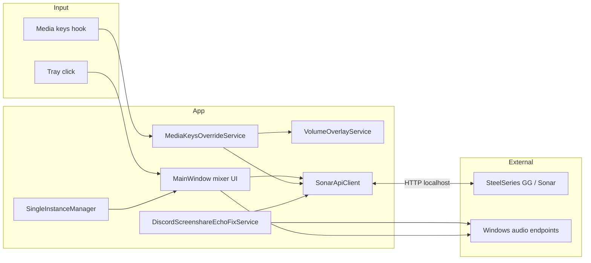

<p align="center">
  
</p>

# Sonar Quick Mixer

[](https://dotnet.microsoft.com/)
[](https://www.microsoft.com/windows)
[](#license)

A lightweight Windows system-tray companion for [SteelSeries Sonar](https://www.steelseries.com/gg/sonar). Open a fast mixer popup, adjust channel volumes without launching SteelSeries GG, redirect hardware media keys to Sonar, and get a clean on-screen volume indicator.

**This project is not affiliated with, endorsed by, or supported by SteelSeries.** It talks to the local Sonar HTTP API exposed by SteelSeries GG while Sonar is running.

---

## Table of contents

- [Why this exists](#why-this-exists)
- [Features](#features)
- [Requirements](#requirements)
- [Installation](#installation)
- [Usage](#usage)
- [Settings reference](#settings-reference)
- [Troubleshooting](#troubleshooting)
- [How it works](#how-it-works)
- [Development](#development)
- [Roadmap](#roadmap)
- [Limitations](#limitations)
- [Contributing](#contributing)
- [License](#license)

---

## Why this exists

SteelSeries Sonar is powerful, but day-to-day control has friction:

| Pain point | What this app does |
|------------|-------------------|
| GG is heavy for a quick volume tweak | Tray popup mixer opens in one click |
| Windows media keys fight Sonar as the default audio device | **Media Keys Override** sends Volume Up/Down/Mute to a Sonar channel |
| No clear feedback when Sonar handles volume | **Volume Overlay** shows channel name, level, and mute state |
| Hard to see which channel is active while mixing | **Audio Visualizer** paints live levels on sliders (WASAPI peak meters) |
| Discord double audio with Sonar routing | **Discord Screenshare Echo Fix** — per-app mute for Discord on Sonar endpoints (mode-dependent; see [Discord Screenshare Echo Fix](#discord-screenshare-echo-fix)) |

Sonar Quick Mixer is a **daily-driver layer on top of Sonar**, not a replacement for GG. Routing apps to channels, mic setup, spatial audio, and driver management still live in SteelSeries GG.

---

## Features

### Quick Mixer (tray popup)

- **Master**, **Game**, **Chat**, **Media**, and **Aux** channels
- Per-channel **mute** and **volume** sliders
- **Streamer mode** support: separate **Monitor** and **Stream** mixes, plus per-channel stream routing toggles
- Anchors near the tray icon; closes when focus leaves the window
- Smooth inertial scrolling in mixer and settings lists
- Status line shows connection state, streamer mode, enabled channels, and API port
- Mixer state syncs from Sonar while the window is open

### Tray icon

Three mixer-bar tray variants plus automatic theme matching:

| Style | When to use |
|-------|-------------|
| **Auto** *(default)* | Dark Windows theme → cyan accent; light theme → dark bars |
| **Accent** | Always cyan (`#60CDFF`), matches the app accent |
| **White** | Neutral bars on dark taskbars |
| **Dark** | Dark bars on light taskbars |

The executable uses a separate **app icon** (rounded tile) for Task Manager, Explorer, and shortcuts. Tray icons are minimal three-bar glyphs without a background tile.

### Media Keys Override

When enabled, global **Volume Up**, **Volume Down**, and **Volume Mute** keys are intercepted and applied to a **selected Sonar channel** (default: Master) via the Sonar API. Windows no longer changes the system volume slider for those keys.

| Key | Action |
|-----|--------|
| Volume Up | +2% on target channel (monitoring mix) |
| Volume Down | −2% on target channel |
| Volume Mute | Toggle mute on target channel |

> **Tip:** If you also assign volume hotkeys inside Sonar, disable them in **SteelSeries GG → Sonar → Settings → Hotkeys** to avoid double actions or confusion. This app only intercepts standard media keys, not Sonar’s custom bindings.

### Volume Overlay

A small top-center HUD appears after successful media-key adjustments (when enabled). It shows the channel name, mute icon, percentage, and an animated level bar.

The overlay is suppressed when it would be distracting:

- Fullscreen Direct3D or presentation mode (Windows notification state)
- A non-owned foreground window covering the monitor

### Audio Visualizer

Optional live level meters on mixer sliders, read from Sonar virtual render devices via [NAudio](https://github.com/naudio/NAudio) WASAPI peak values.

### Discord Screenshare Echo Fix

Prevents Discord audio loops by muting **only Discord** (`Discord`, `DiscordPTB`, `DiscordCanary`) via Windows per-app volume (`sndvol` / WASAPI `SimpleAudioVolume`) on specific endpoints. Sonar channel API is not used. Original per-session mute state is saved and restored when the option is turned off or routing changes.

The service polls every **2 seconds** and reads Sonar routing from `GET /mode` and `GET /streamRedirections`.

| Sonar mode | Endpoint | When targeted |
|------------|----------|---------------|
| **Streamer** | **Sonar — Microphone** (playback / render, not capture) | Always watched |
| **Streamer** | **Sonar — Stream** | Mic **broadcast** to stream mix is on (broadcast icon above mic; API: `streaming` → `chatCapture` / `mic` → `isEnabled`) |
| **Streamer** | **Physical monitoring output** (headset/speakers from `monitoring.deviceId`) | **Self-monitoring** is on (headphones icon above mic; API: `monitoring` → `chatCapture` / `mic` → `isEnabled`) |
| **Classic** | **Sonar — Microphone** (playback / render, not capture) | Always watched |

Mute is applied only when Discord has an audio session on that endpoint. If Discord is not routed there, nothing changes.

**Never muted:** Sonar Microphone **capture** (your mic input to Discord), Sonar Game/Chat/Media/Aux, other applications.

#### Streamer mode (detail)

**Sonar Mic render** — always watched in streamer mode.

**Microphone broadcast** (broadcast icon above the mic) — also mutes Discord on **SteelSeries Sonar — Stream**.

**Self-monitoring** (headphones icon above the mic) — also mutes Discord on your **physical monitoring output** (from Sonar’s `monitoring.deviceId`).

#### Classic mode

Mutes Discord on **SteelSeries Sonar — Microphone** playback (render only) when a Discord session is present on that endpoint.

---

## Requirements

| Requirement | Notes |
|-------------|-------|
| **Windows 10 or later** | 64-bit (`win-x64` publish target) |
| **SteelSeries GG** with **Sonar** installed and running | App discovers Sonar’s local web server from GG config files |
| **[.NET 8 Desktop Runtime](https://dotnet.microsoft.com/download/dotnet/8.0)** | Only if you use the non–self-contained folder publish; the single-file build bundles the runtime |

Sonar must be running before the tray app can connect. There is no standalone Sonar driver mode.

---

## Installation

### Option A — Download from GitHub Releases (recommended)

Open [**Releases**](https://github.com/lixetron/steelseries-sonar-tray/releases) and pick one asset:

| Asset | Best for |
|-------|----------|
| **`SonarQuickMixer-vX.Y.Z-single.exe`** | Most users — self-contained, no separate .NET install |
| **`SonarQuickMixer-vX.Y.Z-win-x64.zip`** | Smaller download — extract the folder and run `SonarQuickMixer.exe`; requires [.NET 8 Desktop Runtime](https://dotnet.microsoft.com/download/dotnet/8.0) |

Run `SonarQuickMixer.exe`. A tray icon appears; left-click opens the mixer.

### Option B — Build a release locally

```powershell
git clone https://github.com/lixetron/steelseries-sonar-tray.git
cd steelseries-sonar-tray

# Self-contained single executable (no separate .NET install needed)
.\scripts\publish.ps1 -Single
# Output: dist-single\SonarQuickMixer.exe

# Or framework-dependent folder publish (requires .NET 8 runtime)
.\scripts\publish.ps1
# Output: dist\SonarQuickMixer.exe (+ .NET 8 runtime)
```

### Option C — Run from source (development)

```powershell
dotnet run --project steelseries-sonar-tray/steelseries-sonar-tray.csproj
```

### Autostart (optional)

Enable **Start with Windows** in **Settings**. The app registers itself in the current-user Run key (`HKCU\Software\Microsoft\Windows\CurrentVersion\Run`) and removes the entry when you turn the option off.

Ensure SteelSeries GG (or at least Sonar) also starts before or with the tray app.

<details>
<summary>Manual startup folder (alternative)</summary>

You can also place a shortcut to `SonarQuickMixer.exe` in the Windows Startup folder (`Win+R` → `shell:startup`). The in-app toggle and a manual shortcut are independent — prefer the Settings toggle for a clean uninstall path.
</details>

---

## Usage

### Open the mixer

| Action | Result |
|--------|--------|
| **Left-click** tray icon | Open mixer anchored near the cursor |
| **Right-click** tray icon → **Open Mixer** | Same |
| **Right-click** → **Exit** | Quit the application |
| **Launch again** while already running | Brings the existing instance to the front (single-instance app) |

Click the gear icon (**Settings**) in the mixer header to switch views. Click **Back** or click outside the window to return / close.

### Adjust volumes

- Drag sliders or click the track to jump (large jumps apply immediately; small drags are throttled for API efficiency).
- Mute buttons toggle the monitoring or streaming path depending on the row.
- In streamer mode, **Stream** rows and mix-routing toggles mirror Sonar’s streamer mixer.

### Configure features

Open **Settings** from the mixer and toggle:

- **Start with Windows** — register autostart in the current-user Run key (off by default)
- **Media Keys Override** + **Target channel**
- **Volume Overlay**
- **Discord Screenshare Echo Fix** — off by default; enable if you need per-mode Discord mute on Sonar endpoints (see [Discord Screenshare Echo Fix](#discord-screenshare-echo-fix))
- **Audio Visualizer**
- **Tray icon** — Auto, Accent, White, or Dark

Settings are written to disk when you change a toggle (or when you close the mixer). On first run, `settings.json` is created on the first save. Tray icon changes apply without restarting the app.

---

## Settings reference

File location:

```text
%LocalAppData%\Lixetron\SonarQuickMixer\settings.json
```

Example:

```json
{
  "RunAtWindowsStartup": false,
  "MediaKeysOverride": false,
  "MediaKeysOverrideChannel": "master",
  "VolumeOverlayEnabled": true,
  "DiscordScreenshareEchoFix": false,
  "AudioVisualizerEnabled": true,
  "TrayIconStyle": 0
}
```

| Property | Type | Default | Description |
|----------|------|---------|-------------|
| `RunAtWindowsStartup` | `bool` | `false` | Add/remove autostart entry in `HKCU\...\Run` |
| `MediaKeysOverride` | `bool` | `false` | Intercept Volume Up/Down/Mute globally |
| `MediaKeysOverrideChannel` | `string` | `"master"` | Target channel: `master`, `game`, `chatRender`, `media`, `aux` |
| `VolumeOverlayEnabled` | `bool` | `true` | Show HUD after media-key volume changes |
| `DiscordScreenshareEchoFix` | `bool` | `false` | Streamer: always Sonar **Mic render**; + **Stream** when mic broadcast; + physical output when self-monitoring. Classic: Sonar Mic render |
| `AudioVisualizerEnabled` | `bool` | `true` | Live level meters on mixer sliders |
| `TrayIconStyle` | `int` (enum) | `0` | `0` Auto, `1` Accent, `2` White, `3` Dark |

You can edit the file while the app is running; reopen settings or restart to ensure all services pick up changes. **Tray icon** updates apply immediately when changed from the mixer UI.

---

## Troubleshooting

### Status shows “Connecting to Sonar…” or “Sonar API unavailable”

1. Open **SteelSeries GG** and confirm **Sonar** is enabled.
2. Restart GG if Sonar was started after the tray app.
3. Check that Sonar’s local API is reachable (status line shows port when connected).
4. Corporate firewalls rarely block localhost, but VPN/security tools sometimes interfere with GG’s local HTTPS.

### Media keys still change Windows volume

- Confirm **Media Keys Override** is enabled in Settings.
- Some keyboards send media keys through proprietary drivers; test with another keyboard or `onboard` media keys.
- Other tools with global keyboard hooks may conflict — disable them temporarily to test.

### Mixer values drift or revert

Sonar is the source of truth. Another client (GG UI, game, hotkeys) may change volumes while the tray mixer is open. The app polls Sonar periodically while visible to resync.

### Volume overlay never appears

- Enable **Volume Overlay** in Settings.
- Overlay only triggers from **Media Keys Override** adjustments today, not from slider changes in the mixer.
- It is intentionally hidden in fullscreen games and presentation mode.

### Media / Aux channels missing

Optional Sonar channels appear only when enabled in Sonar **and** the corresponding virtual device is present in Windows sound settings.

### Discord double audio / echo

**Streamer mode**

- Enable **Discord Screenshare Echo Fix** in Settings if you use Sonar streamer routing and hear double Discord audio.
- **Sonar Mic render** is always watched; Discord is muted there only when it has a session on that endpoint.
- **Sonar Stream:** enable **mic broadcast** (broadcast icon above mic).
- **Physical output:** enable **self-monitoring** (headphones icon above mic).
- In `sndvol`, check **Sonar — Microphone** (Playback), **Sonar — Stream**, and your physical headset/speakers as applicable.

**Classic mode**

- Discord is muted on **Sonar — Microphone** playback (render) only — not capture.

### Tray or app icon looks stale after a rebuild

Windows caches process icons. Fully close the app and Task Manager, then restart the app. If Explorer or Task Manager still shows the old icon, restart Explorer (`taskkill /f /im explorer.exe` then `start explorer.exe`) or sign out and back in.

### After a SteelSeries GG update

GG updates can change the local API surface. If mixing breaks after an update, file an issue with your GG and Sonar versions.

---

## How it works



### Sonar API discovery

`SonarApiClient` resolves Sonar’s web server address from:

1. `%ProgramData%\SteelSeries\SteelSeries Engine 3\coreProps.json` → `ggEncryptedAddress` → HTTPS GG API → `GET /subApps`
2. Fallback: `%ProgramData%\SteelSeries\SteelSeries GG\subApps.json` (local `subApps.sonar.webServerAddress`)

It supports **classic** and **streamer** volume API paths and refreshes streamer mode on demand.

### Key components

| File / area | Role |
|-------------|------|
| `SonarApiClient.cs` | HTTP client for mixer read/write; `GetEchoFixRoutingAsync()` for echo-fix routing |
| `SonarMixerSnapshot.cs` | Mixer state model; `SonarChannels` channel IDs and display names |
| `SonarMixerPath.cs` | Classic vs streamer API path helpers |
| `DiscordScreenshareEchoFixService.cs` | Polls Sonar routing; per-app Discord mute on WASAPI endpoints |
| `SonarEchoFixRouting.cs` | Streamer/classic flags: broadcast, self-monitoring, monitoring device ID |
| `Audio/SonarVirtualMicrophoneRenderProbe.cs` | Locate Sonar Microphone **render** endpoint |
| `Audio/SonarVirtualStreamProbe.cs` | Locate Sonar Stream endpoint |
| `Audio/SonarVirtualChannelProbe.cs` | Shared WASAPI device lookup for Sonar virtual channels |
| `Audio/WindowsAudioDeviceProbe.cs` | Resolve physical output by Sonar `deviceId` |
| `Audio/SonarChannelLevelMonitor.cs` | WASAPI peak polling for visualizer |
| `MainWindow.xaml(.cs)` | Tray popup UI, slider bindings, settings |
| `TrayWindowPlacement.cs` | Anchor mixer near tray / cursor |
| `Controls/SmoothScrolling.cs` | Inertial scroll for mixer and settings `ScrollViewer`s |
| `Controls/SliderLevelProperties.cs` | Attached properties for visualizer level bars on sliders |
| `MediaKeysOverrideService.cs` | Low-level keyboard hook (`WH_KEYBOARD_LL`) |
| `VolumeOverlayService.cs` | Overlay lifecycle and debounced hide |
| `VolumeNotificationGuard.cs` | Fullscreen / focus-aware overlay suppression |
| `SingleInstanceManager.cs` | Mutex + named pipe; second launch focuses existing mixer |
| `WindowsStartupRegistration.cs` | `HKCU\...\Run` autostart registration |
| `TrayIconProvider.cs` | Tray icon loading and Windows theme detection |
| `AppSettings.cs` | JSON settings load/save |
| `Assets/` | App and tray icons (`.ico` / `.png`) |

---

## Development

### Prerequisites

- Windows 10+
- [.NET 8 SDK](https://dotnet.microsoft.com/download/dotnet/8.0)
- PowerShell (for publish and icon scripts)

### Build

```powershell
dotnet build steelseries-sonar-tray.sln -c Release
```

VS Code tasks (`.vscode/tasks.json`):

| Task | Command |
|------|---------|
| `build: release` | `dotnet build` Release |
| `run` | `dotnet run` |
| `publish: dist` | Folder publish → `dist/` |
| `publish: single exe` | Self-contained single file → `dist-single/` |

### Publish profiles

| Profile | Output | Self-contained |
|---------|--------|----------------|
| `Folder` | `dist/SonarQuickMixer.exe` | No (.NET 8 runtime required) |
| `SingleFile` | `dist-single/SonarQuickMixer.exe` | Yes (`win-x64`) |

### Cutting a release

1. Bump `<Version>` in `steelseries-sonar-tray.csproj` if needed.
2. Commit, push to GitHub, and tag:

   ```powershell
   git tag v1.0.0
   git push origin master --tags
   ```

3. The [Release workflow](.github/workflows/release.yml) builds both assets and publishes a GitHub Release with auto-generated notes. Edit the release description on GitHub if you want to highlight specific changes.

### Project structure

**Naming**

| Context | Name |
|---------|------|
| Display name (UI, file properties, autostart) | Sonar Quick Mixer |
| Executable, namespace, AppData, mutex | `SonarQuickMixer` |
| Repository / folders on disk | `steelseries-sonar-tray` (GitHub repo name) |

```text
steelseries-sonar-tray/          # repository root (GitHub name unchanged)
├── steelseries-sonar-tray.sln
├── steelseries-sonar-tray/        # .NET project folder
│   ├── steelseries-sonar-tray.csproj   # builds SonarQuickMixer.exe
│   ├── App.xaml(.cs)              # Tray icon, app lifetime, single instance
│   ├── MainWindow.xaml(.cs)       # Mixer + settings UI
│   ├── SonarApiClient.cs          # Sonar HTTP API
│   ├── SonarMixerSnapshot.cs      # Mixer snapshot + SonarChannels
│   ├── SonarMixerPath.cs
│   ├── SonarEchoFixRouting.cs     # Echo-fix routing model
│   ├── MediaKeysOverrideService.cs
│   ├── DiscordScreenshareEchoFixService.cs
│   ├── SingleInstanceManager.cs
│   ├── WindowsStartupRegistration.cs
│   ├── TrayIconProvider.cs        # Tray icon styles + theme auto
│   ├── TrayWindowPlacement.cs
│   ├── VolumeOverlay*.cs          # Overlay window + service
│   ├── Controls/                  # SmoothScrolling, slider level meters
│   ├── Audio/                     # WASAPI probes + channel level monitor
│   ├── Assets/                    # Icons
│   │   ├── app.ico / app-icon.png # Executable icon (Task Manager, Explorer)
│   │   ├── tray-accent.*          # Cyan tray glyph
│   │   ├── tray-white.*           # White tray glyph
│   │   └── tray-dark.*            # Dark tray glyph
│   ├── Themes/FluentDark.xaml
│   └── Properties/PublishProfiles/
├── scripts/
│   ├── GenerateIcons.ps1          # Regenerate all icons from code
│   └── publish.ps1
└── README.md
```

### Regenerating icons

Icons are drawn programmatically (Fluent dark tile + cyan mixer bars). After changing colors or proportions in `scripts/GenerateIcons.ps1`, regenerate and rebuild:

```powershell
powershell -ExecutionPolicy Bypass -File scripts/GenerateIcons.ps1
dotnet build steelseries-sonar-tray/steelseries-sonar-tray.csproj -c Release
```

Commit both the script output (`*.ico`, `*.png`) and any script changes. The build embeds tray `.ico` files as resources and links `app.ico` as the application icon.

### Tech stack

- **.NET 8** — WPF + Windows Forms (`NotifyIcon`)
- **NAudio 2.3** — audio meter endpoints
- **Win32** — keyboard hook, fullscreen detection, DPI-aware overlay placement

---

## Roadmap

Planned or discussed enhancements:

- [x] **Discord Screenshare Echo Fix** — streamer mode (broadcast / self-monitoring) + classic (Sonar Mic render)
- [ ] **Custom hotkeys per channel** — user-defined bindings instead of only media keys
- [ ] **Physical device support** — Stream Deck, MIDI/HID knobs, custom mix controllers
- [ ] **Volume overlay on all volume changes** — requires polling or push from Sonar (not available today)
- [x] **GitHub Releases** — pre-built binaries for non-builders (tag `v*` → CI builds single `.exe` + folder `.zip`)

---

## Limitations

**In scope:** fast mixer access, media key redirection, overlay, visualizer, customizable tray icon, Windows autostart toggle, single-instance tray behavior, Discord echo fix (per-app mute on Sonar Stream / Mic render / physical monitoring output).

**Out of scope:**

- Replacing SteelSeries GG or the Sonar driver
- Per-application audio routing (assign apps to Game/Chat/etc.)
- Microphone / Sonar Voice / EQ / spatial audio configuration
- Fixing Sonar driver bugs or GG performance
- macOS / Linux (Sonar is Windows-only)

The Sonar HTTP API is undocumented and may change without notice. This app is best-effort compatibility.

---

## Contributing

Issues and pull requests are welcome.

When reporting bugs, please include:

- Windows version
- SteelSeries GG and Sonar version
- Steps to reproduce
- Relevant excerpt of `settings.json` (no secrets expected there)
- Whether streamer mode is enabled

For code changes:

1. Fork and create a feature branch.
2. Keep diffs focused; match existing C# / WPF style.
3. Verify `dotnet build steelseries-sonar-tray.sln -c Release` passes.
4. If you change icons, run `scripts/GenerateIcons.ps1` and include updated `Assets/`.
5. Describe user-visible behavior in the PR.

---

## License

[MIT](LICENSE) — Copyright © 2026 Lixetron.

---

**SteelSeries**, **SteelSeries GG**, and **Sonar** are trademarks of SteelSeries ApS. This project is an independent community utility.
