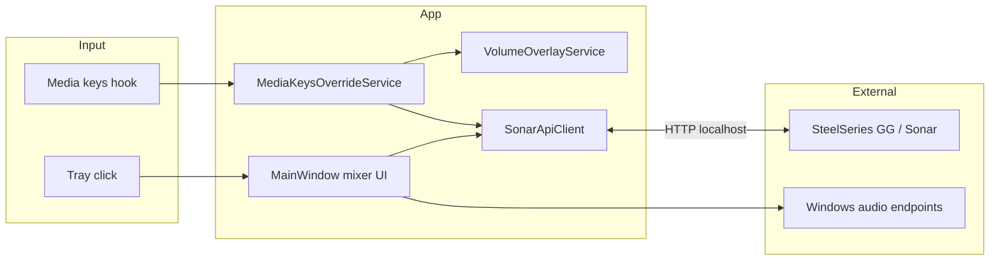

<p align="center">
  
</p>

# Sonar Quick Mixer

[](https://dotnet.microsoft.com/)
[](https://www.microsoft.com/windows)
[](#license)

A lightweight Windows system-tray companion for [SteelSeries Sonar](https://www.steelseries.com/gg/sonar). Open a fast mixer popup, adjust channel volumes without launching SteelSeries GG, redirect hardware media keys to Sonar, and get a clean on-screen volume indicator.

**This project is not affiliated with, endorsed by, or supported by SteelSeries.** It talks to the local Sonar HTTP API exposed by SteelSeries GG while Sonar is running.

---

## Table of contents

- [Why this exists](#why-this-exists)
- [Features](#features)
- [Requirements](#requirements)
- [Installation](#installation)
- [Usage](#usage)
- [Settings reference](#settings-reference)
- [Troubleshooting](#troubleshooting)
- [How it works](#how-it-works)
- [Development](#development)
- [Roadmap](#roadmap)
- [Limitations](#limitations)
- [Contributing](#contributing)
- [License](#license)

---

## Why this exists

SteelSeries Sonar is powerful, but day-to-day control has friction:

| Pain point | What this app does |
|------------|-------------------|
| GG is heavy for a quick volume tweak | Tray popup mixer opens in one click |
| Windows media keys fight Sonar as the default audio device | **Media Keys Override** sends Volume Up/Down/Mute to a Sonar channel |
| No clear feedback when Sonar handles volume | **Volume Overlay** shows channel name, level, and mute state |
| Hard to see which channel is active while mixing | **Audio Visualizer** paints live levels on sliders (WASAPI peak meters) |
| Discord screenshare echo with Sonar routing | **Discord Screenshare Echo Fix** *(planned)* |

Sonar Quick Mixer is a **daily-driver layer on top of Sonar**, not a replacement for GG. Routing apps to channels, mic setup, spatial audio, and driver management still live in SteelSeries GG.

---

## Features

### Quick Mixer (tray popup)

- **Master**, **Game**, **Chat**, **Media**, and **Aux** channels
- Per-channel **mute** and **volume** sliders
- **Streamer mode** support: separate **Monitor** and **Stream** mixes, plus per-channel stream routing toggles
- Anchors near the tray icon; closes when focus leaves the window
- Status line shows connection state, streamer mode, enabled channels, and API port
- Mixer state syncs from Sonar while the window is open

### Tray icon

Three mixer-bar tray variants plus automatic theme matching:

| Style | When to use |
|-------|-------------|
| **Auto** *(default)* | Dark Windows theme → cyan accent; light theme → dark bars |
| **Accent** | Always cyan (`#60CDFF`), matches the app accent |
| **White** | Neutral bars on dark taskbars |
| **Dark** | Dark bars on light taskbars |

The executable uses a separate **app icon** (rounded tile) for Task Manager, Explorer, and shortcuts. Tray icons are minimal three-bar glyphs without a background tile.

### Media Keys Override

When enabled, global **Volume Up**, **Volume Down**, and **Volume Mute** keys are intercepted and applied to a **selected Sonar channel** (default: Master) via the Sonar API. Windows no longer changes the system volume slider for those keys.

| Key | Action |
|-----|--------|
| Volume Up | +2% on target channel (monitoring mix) |
| Volume Down | −2% on target channel |
| Volume Mute | Toggle mute on target channel |

> **Tip:** If you also assign volume hotkeys inside Sonar, disable them in **SteelSeries GG → Sonar → Settings → Hotkeys** to avoid double actions or confusion. This app only intercepts standard media keys, not Sonar’s custom bindings.

### Volume Overlay

A small top-center HUD appears after successful media-key adjustments (when enabled). It shows the channel name, mute icon, percentage, and an animated level bar.

The overlay is suppressed when it would be distracting:

- Fullscreen Direct3D or presentation mode (Windows notification state)
- A non-owned foreground window covering the monitor

### Audio Visualizer

Optional live level meters on mixer sliders, read from Sonar virtual render devices via [NAudio](https://github.com/naudio/NAudio) WASAPI peak values.

### Discord Screenshare Echo Fix

> **Status: not implemented yet** — setting exists in UI and `settings.json` for forward compatibility.

Planned behavior: detect Discord’s render audio session during screenshare and mute the **Chat** (`chatRender`) path to reduce echo loops common with Sonar virtual devices.

---

## Requirements

| Requirement | Notes |
|-------------|-------|
| **Windows 10 or later** | 64-bit (`win-x64` publish target) |
| **SteelSeries GG** with **Sonar** installed and running | App discovers Sonar’s local web server from GG config files |
| **[.NET 8 Desktop Runtime](https://dotnet.microsoft.com/download/dotnet/8.0)** | Only if you use the non–self-contained folder publish; the single-file build bundles the runtime |

Sonar must be running before the tray app can connect. There is no standalone Sonar driver mode.

---

## Installation

### Option A — Build a release locally (recommended today)

```powershell
git clone https://github.com/lixetron/steelseries-sonar-tray.git
cd steelseries-sonar-tray

# Self-contained single executable (no separate .NET install needed)
.\scripts\publish.ps1 -Single
# Output: dist-single\steelseries-sonar-tray.exe

# Or framework-dependent folder publish (requires .NET 8 runtime)
.\scripts\publish.ps1
# Output: dist\
```

Run `steelseries-sonar-tray.exe`. A tray icon appears; left-click opens the mixer.

### Option B — Run from source (development)

```powershell
dotnet run --project steelseries-sonar-tray/steelseries-sonar-tray.csproj
```

### Autostart (optional)

Windows does not configure this automatically. To start with Windows:

1. Press `Win+R`, type `shell:startup`, press Enter.
2. Create a shortcut to `steelseries-sonar-tray.exe` in that folder.

Ensure SteelSeries GG (or at least Sonar) also starts before or with the tray app.

---

## Usage

### Open the mixer

| Action | Result |
|--------|--------|
| **Left-click** tray icon | Open mixer anchored near the cursor |
| **Right-click** tray icon → **Open Mixer** | Same |
| **Right-click** → **Exit** | Quit the application |

Click the gear icon (**Settings**) in the mixer header to switch views. Click **Back** or click outside the window to return / close.

### Adjust volumes

- Drag sliders or click the track to jump (large jumps apply immediately; small drags are throttled for API efficiency).
- Mute buttons toggle the monitoring or streaming path depending on the row.
- In streamer mode, **Stream** rows and mix-routing toggles mirror Sonar’s streamer mixer.

### Configure features

Open **Settings** from the mixer and toggle:

- **Media Keys Override** + **Target channel**
- **Volume Overlay**
- **Discord Screenshare Echo Fix** *(no effect until implemented)*
- **Audio Visualizer**
- **Tray icon** — Auto, Accent, White, or Dark

Settings persist immediately to disk. Tray icon changes apply without restarting the app.

---

## Settings reference

File location:

```text
%LocalAppData%\SteelSeries\SonarTray\settings.json
```

Example:

```json
{
  "MediaKeysOverride": true,
  "MediaKeysOverrideChannel": "master",
  "VolumeOverlayEnabled": true,
  "DiscordScreenshareEchoFix": false,
  "AudioVisualizerEnabled": true,
  "TrayIconStyle": 0
}
```

| Property | Type | Default | Description |
|----------|------|---------|-------------|
| `MediaKeysOverride` | `bool` | `false` | Intercept Volume Up/Down/Mute globally |
| `MediaKeysOverrideChannel` | `string` | `"master"` | Target channel: `master`, `game`, `chatRender`, `media`, `aux` |
| `VolumeOverlayEnabled` | `bool` | `true` | Show HUD after media-key volume changes |
| `DiscordScreenshareEchoFix` | `bool` | `false` | Reserved for future Discord echo mitigation |
| `AudioVisualizerEnabled` | `bool` | `true` | Live level meters on mixer sliders |
| `TrayIconStyle` | `int` (enum) | `0` | `0` Auto, `1` Accent, `2` White, `3` Dark |

You can edit the file while the app is running; reopen settings or restart to ensure all services pick up changes. **Tray icon** updates apply immediately when changed from the mixer UI.

---

## Troubleshooting

### Status shows “Connecting to Sonar…” or “Sonar API unavailable”

1. Open **SteelSeries GG** and confirm **Sonar** is enabled.
2. Restart GG if Sonar was started after the tray app.
3. Check that Sonar’s local API is reachable (status line shows port when connected).
4. Corporate firewalls rarely block localhost, but VPN/security tools sometimes interfere with GG’s local HTTPS.

### Media keys still change Windows volume

- Confirm **Media Keys Override** is enabled in Settings.
- Some keyboards send media keys through proprietary drivers; test with another keyboard or `onboard` media keys.
- Other tools with global keyboard hooks may conflict — disable them temporarily to test.

### Mixer values drift or revert

Sonar is the source of truth. Another client (GG UI, game, hotkeys) may change volumes while the tray mixer is open. The app polls Sonar periodically while visible to resync.

### Volume overlay never appears

- Enable **Volume Overlay** in Settings.
- Overlay only triggers from **Media Keys Override** adjustments today, not from slider changes in the mixer.
- It is intentionally hidden in fullscreen games and presentation mode.

### Media / Aux channels missing

Optional Sonar channels appear only when enabled in Sonar **and** the corresponding virtual device is present in Windows sound settings.

### Tray or app icon looks stale after a rebuild

Windows caches process icons. Fully close the app and Task Manager, then restart the app. If Explorer or Task Manager still shows the old icon, restart Explorer (`taskkill /f /im explorer.exe` then `start explorer.exe`) or sign out and back in.

### After a SteelSeries GG update

GG updates can change the local API surface. If mixing breaks after an update, file an issue with your GG and Sonar versions.

---

## How it works



### Sonar API discovery

`SonarApiClient` resolves Sonar’s web server address from:

1. `%ProgramData%\SteelSeries\SteelSeries Engine 3\coreProps.json` → GG encrypted address → `/subApps`
2. Fallback local config under SteelSeries GG app data

It supports **classic** and **streamer** volume API paths and refreshes streamer mode on demand.

### Key components

| File / area | Role |
|-------------|------|
| `SonarApiClient.cs` | HTTP client for mixer read/write |
| `MainWindow.xaml(.cs)` | Tray popup UI, slider bindings, settings |
| `MediaKeysOverrideService.cs` | Low-level keyboard hook (`WH_KEYBOARD_LL`) |
| `VolumeOverlayService.cs` | Overlay lifecycle and debounced hide |
| `VolumeNotificationGuard.cs` | Fullscreen / focus-aware overlay suppression |
| `Audio/SonarChannelLevelMonitor.cs` | WASAPI peak polling for visualizer |
| `TrayIconProvider.cs` | Tray icon loading and Windows theme detection |
| `AppSettings.cs` | JSON settings load/save |
| `Assets/` | App and tray icons (`.ico` / `.png`) |

---

## Development

### Prerequisites

- Windows 10+
- [.NET 8 SDK](https://dotnet.microsoft.com/download/dotnet/8.0)
- PowerShell (for publish and icon scripts)

### Build

```powershell
dotnet build steelseries-sonar-tray.sln -c Release
```

VS Code tasks (`.vscode/tasks.json`):

| Task | Command |
|------|---------|
| `build: release` | `dotnet build` Release |
| `run` | `dotnet run` |
| `publish: dist` | Folder publish → `dist/` |
| `publish: single exe` | Self-contained single file → `dist-single/` |

### Publish profiles

| Profile | Output | Self-contained |
|---------|--------|----------------|
| `Folder` | `dist/` | No (.NET 8 runtime required) |
| `SingleFile` | `dist-single/steelseries-sonar-tray.exe` | Yes (`win-x64`) |

### Project structure

```text
steelseries-sonar-tray/
├── steelseries-sonar-tray.sln
├── steelseries-sonar-tray/
│   ├── App.xaml(.cs)              # Tray icon, app lifetime
│   ├── MainWindow.xaml(.cs)       # Mixer + settings UI
│   ├── SonarApiClient.cs          # Sonar HTTP API
│   ├── MediaKeysOverrideService.cs
│   ├── TrayIconProvider.cs        # Tray icon styles + theme auto
│   ├── VolumeOverlay*.cs          # Overlay window + service
│   ├── Audio/                     # WASAPI level monitoring
│   ├── Assets/                    # Icons and generator script
│   │   ├── app.ico / app-icon.png # Executable icon (Task Manager, Explorer)
│   │   ├── tray-accent.*          # Cyan tray glyph
│   │   ├── tray-white.*           # White tray glyph
│   │   ├── tray-dark.*            # Dark tray glyph
│   │   └── GenerateIcons.ps1      # Regenerate all icons from code
│   ├── Themes/FluentDark.xaml
│   └── Properties/PublishProfiles/
├── scripts/publish.ps1
└── README.md
```

### Regenerating icons

Icons are drawn programmatically (Fluent dark tile + cyan mixer bars). After changing colors or proportions in `GenerateIcons.ps1`, regenerate and rebuild:

```powershell
powershell -ExecutionPolicy Bypass -File steelseries-sonar-tray/Assets/GenerateIcons.ps1
dotnet build steelseries-sonar-tray/steelseries-sonar-tray.csproj -c Release
```

Commit both the script output (`*.ico`, `*.png`) and any script changes. The build embeds tray `.ico` files as resources and links `app.ico` as the application icon.

### Tech stack

- **.NET 8** — WPF + Windows Forms (`NotifyIcon`)
- **NAudio 2.3** — audio meter endpoints
- **Win32** — keyboard hook, fullscreen detection, DPI-aware overlay placement

---

## Roadmap

Planned or discussed enhancements:

- [ ] **Discord Screenshare Echo Fix** — automatic `chatRender` session handling for Discord
- [ ] **Custom hotkeys per channel** — user-defined bindings instead of only media keys
- [ ] **Physical device support** — Stream Deck, MIDI/HID knobs, custom mix controllers
- [ ] **Volume overlay on all volume changes** — requires polling or push from Sonar (not available today)
- [ ] **GitHub Releases** — pre-built binaries for non-builders

---

## Limitations

**In scope:** fast mixer access, media key redirection, overlay, visualizer, customizable tray icon, future Discord workaround.

**Out of scope:**

- Replacing SteelSeries GG or the Sonar driver
- Per-application audio routing (assign apps to Game/Chat/etc.)
- Microphone / Sonar Voice / EQ / spatial audio configuration
- Fixing Sonar driver bugs or GG performance
- macOS / Linux (Sonar is Windows-only)

The Sonar HTTP API is undocumented and may change without notice. This app is best-effort compatibility.

---

## Contributing

Issues and pull requests are welcome.

When reporting bugs, please include:

- Windows version
- SteelSeries GG and Sonar version
- Steps to reproduce
- Relevant excerpt of `settings.json` (no secrets expected there)
- Whether streamer mode is enabled

For code changes:

1. Fork and create a feature branch.
2. Keep diffs focused; match existing C# / WPF style.
3. Verify `dotnet build steelseries-sonar-tray.sln -c Release` passes.
4. If you change icons, run `GenerateIcons.ps1` and include updated `Assets/`.
5. Describe user-visible behavior in the PR.

---

## License

No license file is included in this repository yet. All rights reserved by the repository owner until a license is added. If you plan to distribute forks or binaries publicly, add an explicit license (e.g. MIT) first.

---

**SteelSeries**, **SteelSeries GG**, and **Sonar** are trademarks of SteelSeries ApS. This project is an independent community utility.
