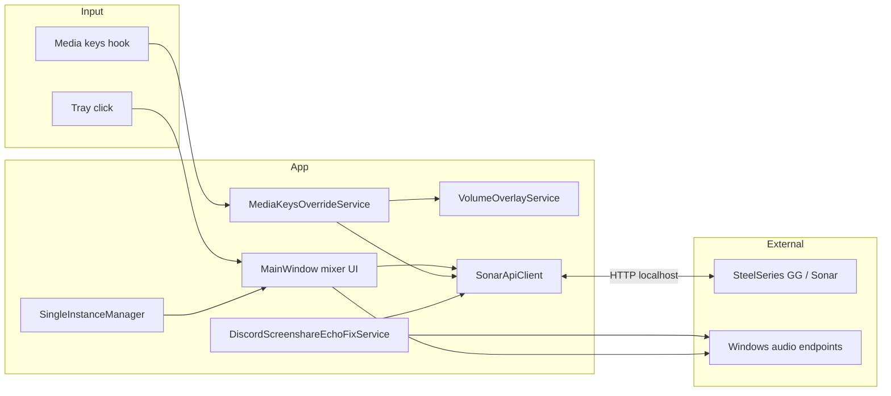

# Architecture

[← Back to README](../README.md) · [Development](development.md)

---

## Overview

## Sonar API discovery

`SonarApiClient` resolves Sonar’s web server from:

1. `%ProgramData%\SteelSeries\SteelSeries Engine 3\coreProps.json` → GG API → `GET /subApps`
2. Fallback: `%ProgramData%\SteelSeries\SteelSeries GG\subApps.json`

Supports **classic** and **streamer** volume API paths; streamer mode is refreshed on demand.

## Key components

| Area | Role |
|------|------|
| `SonarApiClient.cs` | HTTP client; mixer read/write; echo-fix routing |
| `SonarMixerSnapshot.cs` / `SonarMixerPath.cs` | Mixer model and classic/streamer API paths |
| `DiscordScreenshareEchoFixService.cs` / `SonarEchoFixRouting.cs` | Per-app Discord mute on WASAPI endpoints |
| `Audio/*` | WASAPI device probes and channel level monitor |
| `MainWindow.xaml(.cs)` | Mixer UI, settings, slider bindings |
| `MediaKeysOverrideService.cs` | Low-level keyboard hook (`WH_KEYBOARD_LL`) |
| `VolumeOverlay*.cs` / `VolumeNotificationGuard.cs` | Overlay lifecycle and suppression |
| `SingleInstanceManager.cs` | Mutex + named pipe |
| `TrayIconProvider.cs` / `TrayWindowPlacement.cs` | Tray icon and popup placement |
| `AppSettings.cs` / `WindowsStartupRegistration.cs` | Settings and autostart |
| `GitHubUpdateChecker.cs` / `AppVersion.cs` | Update check and version |

**.NET 8** (WPF + Windows Forms), **NAudio 2.3**, **Win32** (keyboard hook, fullscreen detection, DPI).
