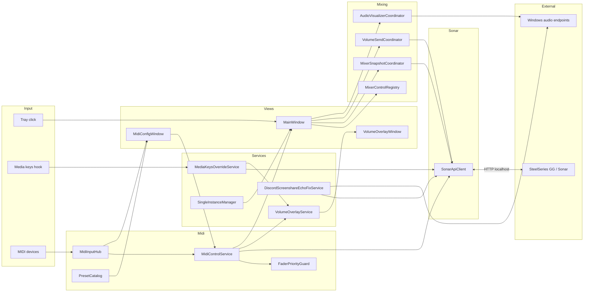
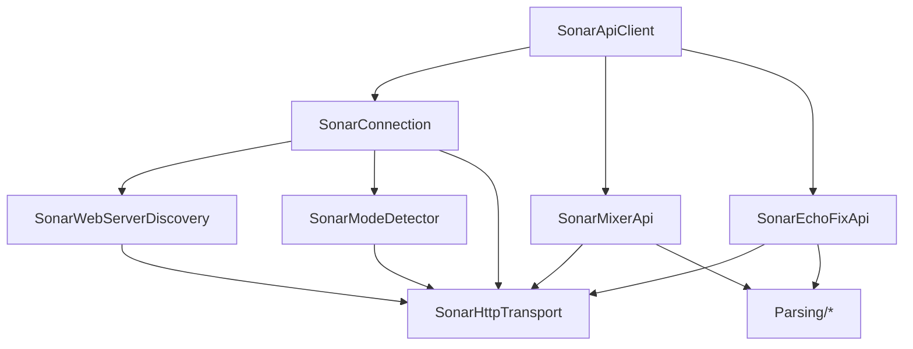

# Architecture

[← Back to README](../README.md) · [Development](development.md)

---

## Overview


```mermaid
flowchart LR
  subgraph Input
    Tray[Tray click]
    Keys[Media keys hook]
    MidiDev[MIDI devices]
  end

  subgraph Views
    MW[MainWindow]
    VO[VolumeOverlayWindow]
    MIDIUI[MidiConfigWindow]
  end

  subgraph Mixing
    REG[MixerControlRegistry]
    SYNC[MixerSnapshotCoordinator]
    VOL[VolumeSendCoordinator]
    VIS[AudioVisualizerCoordinator]
  end

  subgraph Services
    MKO[MediaKeysOverrideService]
    VOS[VolumeOverlayService]
    DEF[DiscordScreenshareEchoFixService]
    SI[SingleInstanceManager]
  end

  subgraph MidiLayer [Midi]
    Hub[MidiInputHub]
    MCS[MidiControlService]
    Guard[FaderPriorityGuard]
    Presets[PresetCatalog]
  end

  subgraph Sonar
    API[SonarApiClient]
  end

  subgraph External
    GG[SteelSeries GG / Sonar]
    WASAPI[Windows audio endpoints]
  end

  Tray --> MW
  MW --> REG
  MW --> SYNC
  MW --> VOL
  MW --> VIS
  SYNC --> API
  VOL --> API
  Keys --> MKO
  MKO --> API
  MKO --> VOS
  MidiDev --> Hub
  Hub --> MCS
  MCS --> Guard
  MCS --> API
  MCS --> VOS
  MCS --> MW
  Presets --> MIDIUI
  Hub --> MIDIUI
  MIDIUI --> MCS
  VOS --> VO
  DEF --> API
  DEF --> WASAPI
  SI --> MW
  API <-->|HTTP localhost| GG
  VIS --> WASAPI
```

## Project layout

| Folder | Namespace | Responsibility |
|--------|-----------|----------------|
| `Views/` | `SonarQuickMixer.Views` | WPF windows and UI controllers (`MainWindow`, `MidiConfigWindow`, overlay layout/animation, settings panel) |
| `Mixing/` | `SonarQuickMixer.Mixing` | Mixer domain logic decoupled from XAML (bindings registry, snapshot sync, volume queue, visualizer) |
| `Midi/` | `SonarQuickMixer.Midi` | Multi-device MIDI input, absolute/relative parsing, mappings, fader priority, Blueprint controller |
| `Services/` | `SonarQuickMixer.Services` | Background app services (media keys, volume overlay, Discord echo fix, single instance) |
| `Sonar/` | `SonarQuickMixer.Sonar` | Sonar HTTP API client and mixer models |
| `Audio/` | `SonarQuickMixer.Audio` | WASAPI device probes and channel level monitor |
| `Settings/` | `SonarQuickMixer.Settings` | Persistent settings and Windows autostart |
| `Tray/` | `SonarQuickMixer.Tray` | Tray icon assets and popup placement |
| `Updates/` | `SonarQuickMixer.Updates` | GitHub release check and version info |
| `Controls/` | `SonarQuickMixer.Controls` | Reusable WPF controls and attached properties |
| `Presets/` | — | Official MIDI device layout JSON (copied to output) |

`App.xaml.cs` stays at the project root and wires services, tray, and the main window together.

## MIDI integration

`MidiControlService` mirrors `MediaKeysOverrideService`: listens in the background, writes Sonar volumes via `SonarApiClient`, raises `VolumeAdjusted` / `MixerChanged`.

- **Multi-device:** `MidiInputHub` opens selected `InputDevice` instances (DryWetMidi) and tags every event with `DeviceName`.
- **Modes:** Absolute CC → `raw/127`; Pitch Bend (SMC-Mixer **DAW Mode / Mode A** faders E0–E7) → 14-bit / `(127<<7)`; Relative encoders → directional ticks × configurable step (default 2%).
- **Feedback:** Layout controls may declare optional `feedback` (`mute` / `channelAssigned`, optional `style: blink`). Official presets stay hardware-only (no baked LEDs). `MidiOutputHub` sends Note/CC/PitchBend from the active layout; Pitch Bend faders use soft-takeover semantics. UI edits are staged until Save (yellow chrome / per-field `*`). `MidiConfigController` shares `MidiControlService.Presets` so saved feedback is what the runtime refreshes. No device-brand branches in code.
- **Presets:** Official JSON under `Presets/` may bake factory hardware (`controller`, `isNote`, `isPitchBend`, `defaultMode`) so reference devices like SMC-Mixer in **DAW Mode** need no Learn — only Sonar channel assignment. User DIY presets live in AppData `UserPresets/` (Save as… / Rename… / Delete). See [MIDI layout preset authoring](midi-preset-authoring.md) for the full JSON schema and hand-editing guide.
- **Anti-fighting:** non-motorized absolute bindings remember hardware position; external Sonar drift starts a 3s window, then rolls back with overlay message.
- **Blueprint UI:** `MidiConfigWindow` (+ dark DWM title bar) renders vector controls from declarative JSON (`Presets/` then `%LocalAppData%\Lixetron\SonarQuickMixer\UserPresets\`).
- **Mappings:** `%LocalAppData%\Lixetron\SonarQuickMixer\midi-mappings.json`.

## Sonar API layer

`SonarApiClient` is a thin **facade** over focused internal components. Public API is unchanged; callers still use `new SonarApiClient()`.


```mermaid
flowchart TB
  Client[SonarApiClient]
  Conn[SonarConnection]
  Mixer[SonarMixerApi]
  Echo[SonarEchoFixApi]
  Http[SonarHttpTransport]
  Disc[SonarWebServerDiscovery]
  Mode[SonarModeDetector]
  Parse[Parsing/*]

  Client --> Conn
  Client --> Mixer
  Client --> Echo
  Conn --> Disc
  Conn --> Mode
  Conn --> Http
  Mixer --> Http
  Mixer --> Parse
  Echo --> Http
  Echo --> Parse
  Disc --> Http
  Mode --> Http
```

### Discovery

Sonar’s web server is resolved from:

1. `%ProgramData%\SteelSeries\SteelSeries Engine 3\coreProps.json` → GG API → `GET /subApps`
2. Fallback: `%ProgramData%\SteelSeries\SteelSeries GG\subApps.json`

Supports **classic** and **streamer** volume API paths; streamer mode is refreshed on demand.

### Sonar folder layout

```
Sonar/
├── SonarApiClient.cs          # public facade
├── Models/
│   ├── SonarMixerSnapshot.cs
│   ├── SonarMixerPath.cs
│   ├── SonarEchoFixRouting.cs
│   └── StreamMixRouting.cs
├── Connection/
│   ├── SonarConnection.cs
│   ├── SonarSession.cs
│   ├── SonarWebServerDiscovery.cs
│   └── SonarModeDetector.cs
├── Http/
│   ├── SonarHttpTransport.cs
│   └── SonarEndpoints.cs
├── Api/
│   ├── SonarMixerApi.cs
│   └── SonarEchoFixApi.cs
└── Parsing/
    ├── VolumeSettingsParser.cs
    ├── StreamMixRoutingParser.cs
    ├── FeatureFlagsParser.cs
    └── JsonBooleanParser.cs
```

| Folder | Role |
|--------|------|
| `Models/` | Public mixer/echo-fix DTOs and channel constants |
| `Connection/` | Discovery, session state, classic/streamer mode |
| `Http/` | Shared HTTP transport and URL builders |
| `Api/` | Mixer read/write and echo-fix routing operations |
| `Parsing/` | Stateless JSON parsers |

## Key components

| Area | Role |
|------|------|
| `Sonar/SonarApiClient.cs` | Public entry point (facade) |
| `Sonar/Models/SonarMixerSnapshot.cs` / `SonarMixerPath.cs` | Mixer model and classic/streamer API paths |
| `Mixing/MixerControlRegistry.cs` | Maps XAML sliders/toggles to Sonar channels and paths |
| `Mixing/MixerSnapshotCoordinator.cs` | Applies API snapshots to UI; status text and cache |
| `Mixing/VolumeSendCoordinator.cs` | Throttled volume writes while dragging sliders |
| `Mixing/AudioVisualizerCoordinator.cs` | Live level meters on mixer sliders |
| `Midi/MidiControlService.cs` | MIDI → Sonar orchestration (absolute/relative, learn, overlay) |
| `Midi/MidiInputHub.cs` | Concurrent multi-device DryWetMidi listeners |
| `Midi/FaderPriorityGuard.cs` | 3s hardware fader rollback / anti-fighting |
| `Midi/PresetCatalog.cs` | Official + AppData layout JSON resolution |
| `Views/MidiConfigWindow.xaml(.cs)` | Blueprint config UI, staging, Learn, dark title bar |
| `Services/DiscordScreenshareEchoFixService.cs` / `Sonar/Models/SonarEchoFixRouting.cs` | Per-app Discord mute on WASAPI endpoints |
| `Audio/*` | WASAPI device probes and channel level monitor |
| `Views/MainWindow.xaml(.cs)` | Overlay shell; delegates mixer/settings logic to coordinators |
| `Views/SettingsPanelController.cs` | Settings toggles, combos, persistence |
| `Services/MediaKeysOverrideService.cs` | Low-level keyboard hook (`WH_KEYBOARD_LL`) |
| `Services/VolumeOverlayService.cs` / `VolumeNotificationGuard.cs` | Overlay lifecycle and suppression |
| `Services/SingleInstanceManager.cs` | Mutex + named pipe |
| `Tray/*` | Tray icon and popup placement |
| `Settings/*` | Settings and autostart |
| `Updates/*` | Update check and version |

**.NET 8** (WPF + Windows Forms), **NAudio 2.3**, **Melanchall.DryWetMidi 8**, **Win32** (keyboard hook, fullscreen detection, DPI).
