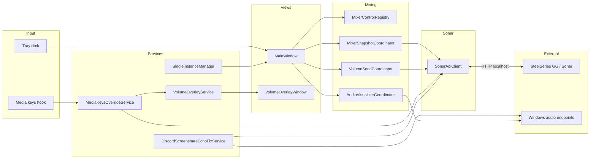

# Architecture

[← Back to README](../README.md) · [Development](development.md)

---

## Overview

```mermaid
flowchart LR
  subgraph Input
    Tray[Tray click]
    Keys[Media keys hook]
  end

  subgraph Views
    MW[MainWindow]
    VO[VolumeOverlayWindow]
  end

  subgraph Mixing
    REG[MixerControlRegistry]
    SYNC[MixerSnapshotCoordinator]
    VOL[VolumeSendCoordinator]
    VIS[AudioVisualizerCoordinator]
  end

  subgraph Services
    MKO[MediaKeysOverrideService]
    VOS[VolumeOverlayService]
    DEF[DiscordScreenshareEchoFixService]
    SI[SingleInstanceManager]
  end

  subgraph Sonar
    API[SonarApiClient]
  end

  subgraph External
    GG[SteelSeries GG / Sonar]
    WASAPI[Windows audio endpoints]
  end

  Tray --> MW
  MW --> REG
  MW --> SYNC
  MW --> VOL
  MW --> VIS
  SYNC --> API
  VOL --> API
  Keys --> MKO
  MKO --> API
  MKO --> VOS
  VOS --> VO
  DEF --> API
  DEF --> WASAPI
  SI --> MW
  API <-->|HTTP localhost| GG
  VIS --> WASAPI
```

## Project layout

| Folder | Namespace | Responsibility |
|--------|-----------|----------------|
| `Views/` | `SonarQuickMixer.Views` | WPF windows and UI controllers (`MainWindow`, overlay layout/animation, settings panel) |
| `Mixing/` | `SonarQuickMixer.Mixing` | Mixer domain logic decoupled from XAML (bindings registry, snapshot sync, volume queue, visualizer) |
| `Services/` | `SonarQuickMixer.Services` | Background app services (media keys, volume overlay, Discord echo fix, single instance) |
| `Sonar/` | `SonarQuickMixer.Sonar` | Sonar HTTP API client and mixer models |
| `Audio/` | `SonarQuickMixer.Audio` | WASAPI device probes and channel level monitor |
| `Settings/` | `SonarQuickMixer.Settings` | Persistent settings and Windows autostart |
| `Tray/` | `SonarQuickMixer.Tray` | Tray icon assets and popup placement |
| `Updates/` | `SonarQuickMixer.Updates` | GitHub release check and version info |
| `Controls/` | `SonarQuickMixer.Controls` | Reusable WPF controls and attached properties |

`App.xaml.cs` stays at the project root and wires services, tray, and the main window together.

## Sonar API discovery

`SonarApiClient` resolves Sonar’s web server from:

1. `%ProgramData%\SteelSeries\SteelSeries Engine 3\coreProps.json` → GG API → `GET /subApps`
2. Fallback: `%ProgramData%\SteelSeries\SteelSeries GG\subApps.json`

Supports **classic** and **streamer** volume API paths; streamer mode is refreshed on demand.

## Key components

| Area | Role |
|------|------|
| `Sonar/SonarApiClient.cs` | HTTP client; mixer read/write; echo-fix routing |
| `Sonar/SonarMixerSnapshot.cs` / `SonarMixerPath.cs` | Mixer model and classic/streamer API paths |
| `Mixing/MixerControlRegistry.cs` | Maps XAML sliders/toggles to Sonar channels and paths |
| `Mixing/MixerSnapshotCoordinator.cs` | Applies API snapshots to UI; status text and cache |
| `Mixing/VolumeSendCoordinator.cs` | Throttled volume writes while dragging sliders |
| `Mixing/AudioVisualizerCoordinator.cs` | Live level meters on mixer sliders |
| `Services/DiscordScreenshareEchoFixService.cs` / `Sonar/SonarEchoFixRouting.cs` | Per-app Discord mute on WASAPI endpoints |
| `Audio/*` | WASAPI device probes and channel level monitor |
| `Views/MainWindow.xaml(.cs)` | Overlay shell; delegates mixer/settings logic to coordinators |
| `Views/SettingsPanelController.cs` | Settings toggles, combos, persistence |
| `Services/MediaKeysOverrideService.cs` | Low-level keyboard hook (`WH_KEYBOARD_LL`) |
| `Services/VolumeOverlayService.cs` / `VolumeNotificationGuard.cs` | Overlay lifecycle and suppression |
| `Services/SingleInstanceManager.cs` | Mutex + named pipe |
| `Tray/*` | Tray icon and popup placement |
| `Settings/*` | Settings and autostart |
| `Updates/*` | Update check and version |

**.NET 8** (WPF + Windows Forms), **NAudio 2.3**, **Win32** (keyboard hook, fullscreen detection, DPI).
